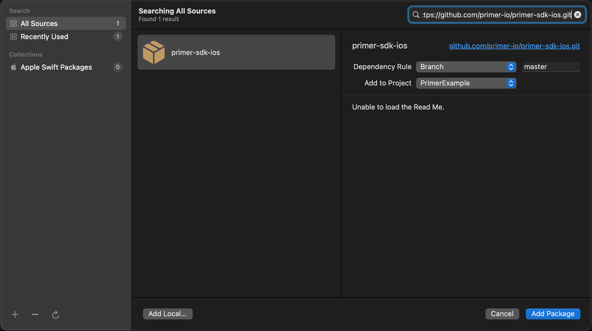

<h1 align="center"> Primer Web SDK</h1>

<div align="center">
  <h3 align="center">

[Primer's](https://primer.io) Official Universal Checkout iOS SDK

  </h3>
</div>

<br/>

<div align="center"></div>

<br/>
<br/>

# 💪 Features of the iOS SDK

<p>💳 &nbsp; Create great payment experiences with our highly customizable Universal Checkout</p>
<p>🧩 &nbsp; Connect and configure any new payment method without a single line of code</p>
<p>✅ &nbsp; Dynamically handle 3DS 2.0 across processors and be SCA ready</p>
<p>♻️ &nbsp; Store payment methods for recurring and repeat payments</p>
<p>🔒 &nbsp; Always PCI compliant without redirecting customers</p>


# 📚 Documentation

Consider looking at the following resources:

- [Documentation](https://primer.io/docs)
- [Client session creation](https://primer.io/docs/accept-payments/manage-client-sessions/#create-a-client-session)
- [API reference](https://apiref.primer.io/docs)
- [Changelogs](https://primer.io/docs/changelog/sdk-changelog/ios)
- [Detailed iOS Documentation](https://www.notion.so/primerapi/iOS-SDK-ebbf44a733624d17bfd0c3a746f171a2)


# 💡 Support

For any support or integration related queries, feel free to [Contact Us](mailto:https://support@primer.io).


## 🚀 Quick start

Take a look at our [Quick Start Guide](https://primer.io/docs/get-started/ios) for accepting your first payment with Universal Checkout.

<br/>

# 🧱 Installation

## With CocoaPods

The iOS SDK is available with Cocoapods. Just add the PrimerSDK pod and run `pod install`.

```swift{:copy}
target 'MyApp' do
  # Other pods...
 
  # Add this to your Podfile
  pod 'PrimerSDK' # Add this line
end

```
For specific versions of the SDK, please refer to the changelog.

## With Swift Package Manager

The Swift Package Manager is a tool for automating the distribution of Swift code and is integrated into Xcode. In order to add PrimerSDK with Swift Package Manager;

1. Select your project, and then navigate to Package Dependencies
2. Click on the + button at the bottom-left of the Packages section
3. Paste https://github.com/primer-io/primer-sdk-ios.git into the Search Bar
4. Press Add Package
5. Let Xcode download the package and set everything up




<br/>

# 👩‍💻 Usage

## 📋 Prerequisites

- 🔑 Generate a client token by [creating a client session](https://primer.io/docs/accept-payments/manage-client-sessions) in your backend.
- 🎉 _That's it!_

## 🔍 &nbsp;Initializing the SDK

Import the Primer SDK and set its delegate as shown in the following example:

```swift{:copy}
import PrimerSDK
 
class MyViewController: UIViewController {
 
    override func viewDidLoad() {
        super.viewDidLoad()
 
        // Initialize the SDK with the default settings.
        let settings = PrimerSettings()
        Primer.shared.configure(settings: settings, delegate: self)
    }
}
 
extension MyViewController: PrimerDelegate {
 
    func primerDidCompleteCheckoutWithData(_ data: CheckoutData) {
        // Primer checkout completed with data
        // do something...
    }
}
```




**Note:** Check the [SDK API Reference](https://www.notion.so/primerio/API-Reference-f62b4be8f24642989e63c25a8fb5f0ba_) for more options to customize your SDK.




## 🔍 &nbsp;Rendering the checkout

Now you can use the client token that you generated on your backend. 
Call the `showUniversalCheckout(clientToken)` function (as shown below) to present Universal Checkout.

```swift{:copy}
class MyViewController: UIViewController {
    func startUniversalCheckout() {
        Primer.shared.showUniversalCheckout(clientToken: self.clientToken)
    }
}
```
You should now be able to see Universal Checkout! The user can now interact with Universal Checkout, and the SDK will create the payment.
The payment’s data will be returned on `primerDidCompleteCheckoutWithData(:)`.



**Note:** There are more options which can be passed to Universal Checkout. Please refer to the section below for more information.



<br/>

## 🧰 &nbsp;Checkout Options

When initializing the SDK you can provide Universal Checkout with some configuration options.

### 🚀 **General Options**

#### ⚙️ _Locale Options_

You can set the locale for all text in the checkout. If not provided, it will default to the device's locale data.

```swift{:copy}
import PrimerSDK
 
class MyViewController: UIViewController {
 
    override func viewDidLoad() {
        super.viewDidLoad()
 
        // Initialize the SDK with the default settings.
        let localeData = PrimerLocaleData(languageCode: "en", 
                                          regionCode: "UK",
                                          localeCode: "en-UK")
        let settings = PrimerSettings(localeData: localeData)
        Primer.shared.configure(settings: settings, delegate: self)
    }
}
```


#### ⚙️ _Debug Options_

You can disable 3DS validation checks on the simulator. It defaults to `true`.

```swift{:copy}
import PrimerSDK
 
class MyViewController: UIViewController {
 
    override func viewDidLoad() {
        super.viewDidLoad()
 
        // Initialize the SDK with the default settings.
        let debugOptions = PrimerDebugOptions(is3DSSanityCheckEnabled: false)
        let settings = PrimerSettings(debugOptions: debugOptions)
        Primer.shared.configure(settings: settings, delegate: self)
    }
}
```


### 💳 **Payment Methods Options**

Learn more about the [payment method specific options](https://www.notion.so/primerio/Checkout-Documentation-589aeae3387a4025917db6e29810ebaf).

The options below are all part of `PrimerPaymentMethodOptions`. See the code example at the end for implementation details.

#### ⚙️ _Redirect Options_

Handling redirects is required for Payment Methods like iDeal that present a webpage for the customer to enter their credentials and validate their payment.

When the user selects such a Payment Method, Universal Checkout will first attempt to show the webpage in a popup or a browser tab to maintain the context, and will then safely bring the user back to the initial page to continue the flow.


| option                   | Type    | Description                                                                                                        |          |
| ------------------------ | ------- |--------------------------------------------------------------------------------------------------------------------|----------|
| `urlScheme`     | `String`  | The URL scheme of your app, will be used to return to your app from another app. This is also required for PayPal. | Required |

#### ⚙️ _Apple Pay Options_

These options only apply to the native Apple Pay implementation (`APPLE_PAY`).

| option                       | Type                              | Description                                  |           |
|------------------------------|-----------------------------------| -------------------------------------------- | ----------|
| `applePayOptions.merchantIdentifier` | `String` | The merchant identifier of your Apple Pay certificate.|  Required |

#### ⚙️ _Klarna Options_

These options only apply to the native Klarna implementation (`KLARNA`).

| option                                      | Type           | Description                    |           |
|---------------------------------------------| ---------------- | ------------------------------------------------- | -------- |
| `klarnaOptions.recurringPaymentDescription` | `String`        | This is used by Klarna as product description.  | optional |


#### Example Code

```swift{:copy}
import PrimerSDK
 
class MyViewController: UIViewController {
 
    override func viewDidLoad() {
        super.viewDidLoad()
 
        // Initialize the SDK with the default settings.
        let paymentMethodOptions = PrimerPaymentMethodOptions(
            urlScheme: "merchant://",
            applePayOptions: PrimerApplePayOptions(merchantIdentifier: "merchant.xxx"))
        let settings = PrimerSettings(paymentMethodOptions: paymentMethodOptions)
        Primer.shared.configure(settings: settings, delegate: self)
    }
}
```

---


## Contributing guidelines:

[Contributing doc](Contributing.md)
